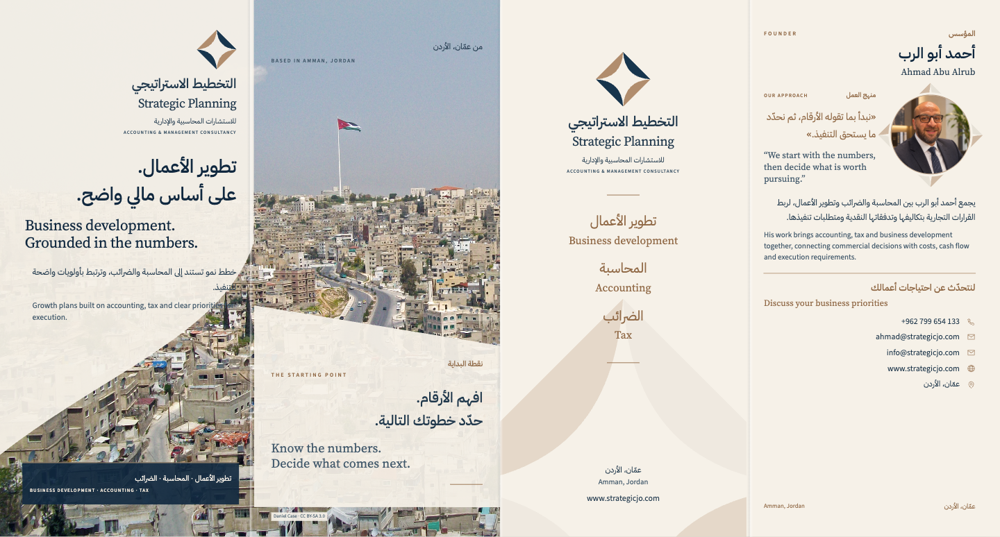
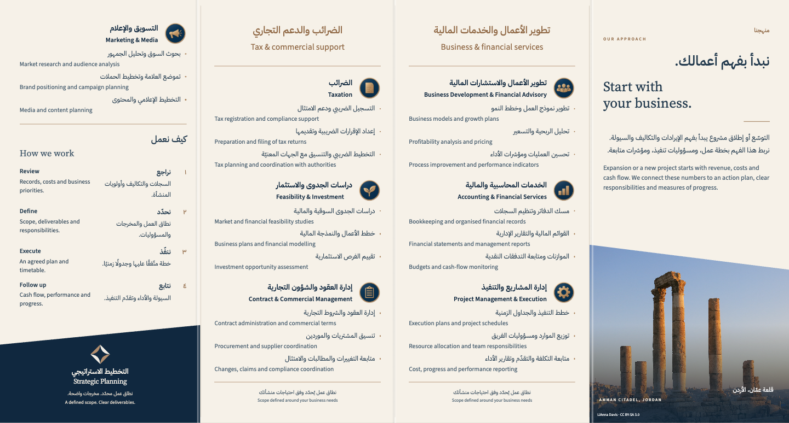

# التخطيط الاستراتيجي

[فتح التصاميم وملفات التحميل النهائية](https://moeadnan.github.io/strategic-planning-print-kit-579666/?v=final26)

بطاقة أعمال ومطويّة واحدة بالعربية والإنجليزية. كل لوح من المطويّة يجمع النص العربي وترجمته الإنجليزية. تعرض الصفحة الوجهين وترتيب الألواح وتعليمات القصّ والطيّ، مع أزرار واضحة للتحميل.

**النسخة النهائية v2.0.0:** تشمل جميع التعديلات المعتمدة، وصورة أحمد الدائرية الصغيرة، وصورة عمّان والعلم الحقيقي. ملفات PDF والحزمتان أُعيد إنتاجها وفحصها من التصميم الحالي.

## التحميل

- [جميع ملفات الطباعة في حزمة واحدة ZIP](https://github.com/moeadnan/strategic-planning-print-kit-579666/releases/download/v2.0.0/Strategic-Planning-Printer-Package.zip)
- [بطاقة الأعمال للطباعة التجارية PDF](https://github.com/moeadnan/strategic-planning-print-kit-579666/releases/download/v2.0.0/Business-Card-PRINT-CMYK.pdf)
- [المطويّة باللغتين للطباعة التجارية PDF](https://github.com/moeadnan/strategic-planning-print-kit-579666/releases/download/v2.0.0/Brochure-Bilingual-PRINT-CMYK.pdf)
- [تعليمات الطباعة والطيّ بالعربية PDF](https://github.com/moeadnan/strategic-planning-print-kit-579666/releases/download/v2.0.0/Print-Specifications.pdf)
- [التصاميم القابلة للتحرير مع الأصول ZIP](https://github.com/moeadnan/strategic-planning-print-kit-579666/releases/download/v2.0.0/Strategic-Planning-Editable-HTML.zip)

تتضمّن الحزمة أيضًا ورقة بطاقات A4 وورقة مطويّة A3 للطباعة المكتبية على الوجهين، بالمقاس الفعلي ١٠٠٪.

## المقاسات والإنتاج

البطاقة: 90 × 55 مم، وجهان. المطويّة: 396 × 210 مم مفتوحة، و99 × 210 مم بعد الطيّ؛ أربعة ألواح وثلاث طيّات متعاكسة. ملفات الإنتاج بنزف 3 مم وعلامات قصّ خارج النزف، وخطوط مضمّنة وملف ألوان PSO Coated v3 / FOGRA51.

اجتازت الملفات الخمسة الفحص الرقمي للمقاسات والخطوط والألوان ودقة الصور. روجعت الصفحات العشر بصريًا، وفُحص امتداد الألوان والصور إلى النزف وتطابق الألوان في أوراق الطباعة. تقارير الفحص في مجلد `previews/` وداخل حزمة المطبعة. تُراجع المطبعة نموذجًا مطبوعًا للون والورق ومحاذاة الوجهين والطيّ قبل تنفيذ الكمية.

تراخيص الخطوط ونسب الصور في [CREDITS.txt](CREDITS.txt). الإصدار السابق محفوظ في سجل الإصدارات؛ روابط هذه الصفحة تخصّ الإصدار النهائي الحالي.

## الوجه الخارجي

## الوجه الداخلي

