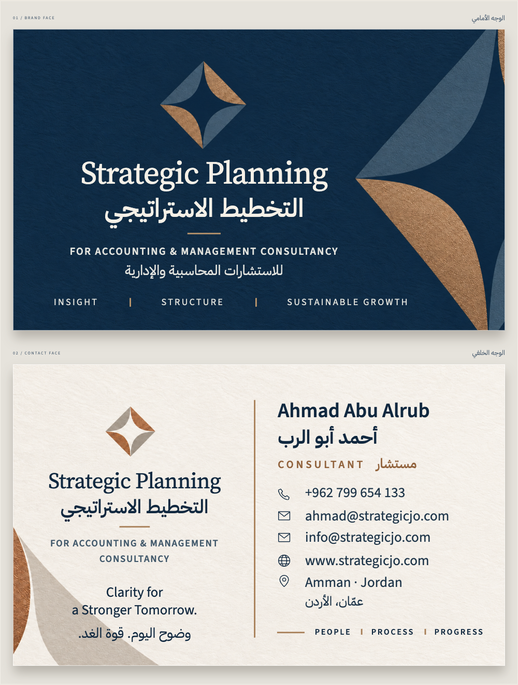
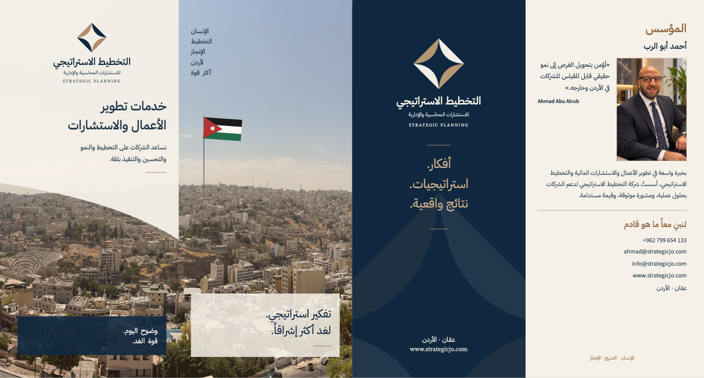
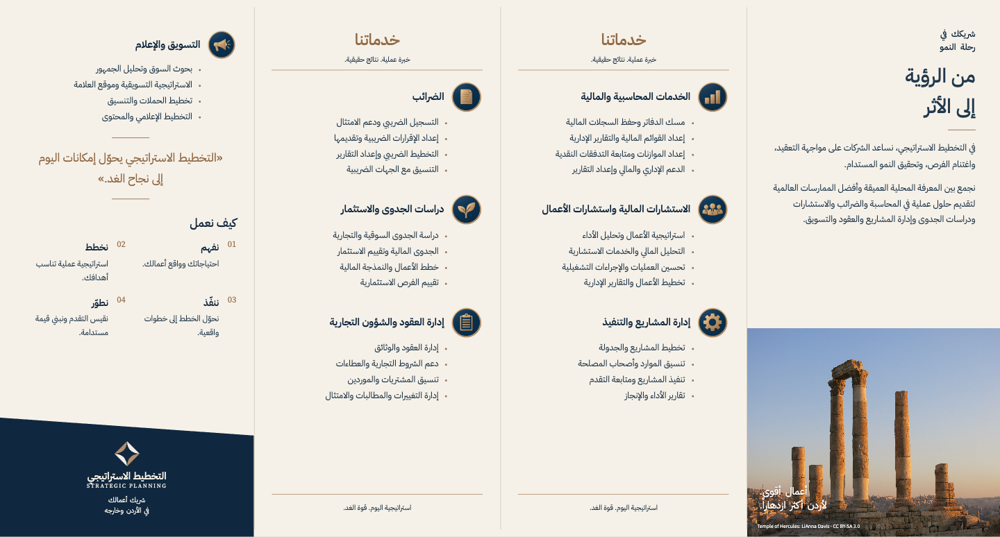
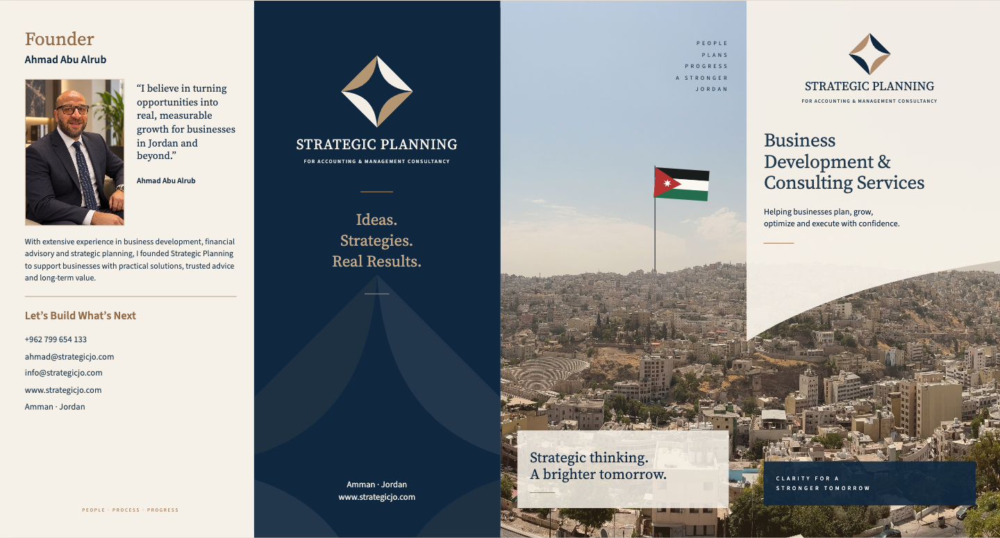
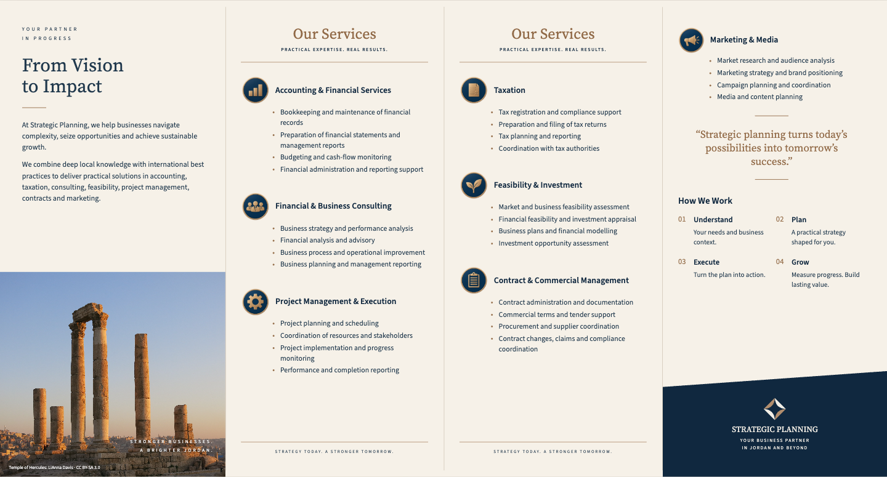

# Strategic Planning | التخطيط الاستراتيجي

Approved bilingual business card and English / Arabic brochures, with commercial and office printing files.

**[Preview and download](https://moeadnan.github.io/strategic-planning-print-kit-579666/#files)**

## Downloads

- [Complete printer package](https://github.com/moeadnan/strategic-planning-print-kit-579666/releases/download/v1.0.0/Strategic-Planning-Printer-Package.zip) — all seven PDFs, print instructions and colour profile.
- [Editable HTML package](https://github.com/moeadnan/strategic-planning-print-kit-579666/releases/download/v1.0.0/Strategic-Planning-Editable-HTML.zip) — offline layouts, local fonts, images, editable source and PDFs.

| File | Download |
| --- | --- |
| Bilingual business card | [Commercial printing PDF](https://github.com/moeadnan/strategic-planning-print-kit-579666/releases/download/v1.0.0/Business-Card-PRINT-CMYK.pdf) |
| English brochure | [Commercial printing PDF](https://github.com/moeadnan/strategic-planning-print-kit-579666/releases/download/v1.0.0/Brochure-English-PRINT-CMYK.pdf) |
| Arabic brochure | [Commercial printing PDF](https://github.com/moeadnan/strategic-planning-print-kit-579666/releases/download/v1.0.0/Brochure-Arabic-PRINT-CMYK.pdf) |
| Business card, A4 office sheets | [Office PDF](https://github.com/moeadnan/strategic-planning-print-kit-579666/releases/download/v1.0.0/Business-Card-Office-A4.pdf) |
| English brochure, A3 office sheets | [Office PDF](https://github.com/moeadnan/strategic-planning-print-kit-579666/releases/download/v1.0.0/Brochure-English-Office-A3.pdf) |
| Arabic brochure, A3 office sheets | [Office PDF](https://github.com/moeadnan/strategic-planning-print-kit-579666/releases/download/v1.0.0/Brochure-Arabic-Office-A3.pdf) |
| Printing and folding instructions | [Specification PDF](https://github.com/moeadnan/strategic-planning-print-kit-579666/releases/download/v1.0.0/Print-Specifications.pdf) |

## Printing

Business card: **90 × 55 mm**, two sides, 3 mm bleed. Brochures: **396 × 210 mm** flat, four-panel accordion fold, **99 × 210 mm** folded. English and Arabic are separate editions.

For office printing, use actual size / 100%. A4 cards: duplex, flip on the long edge. A3 brochures: duplex, flip on the short edge. Check one physical proof before the full run.

Commercial PDFs include CMYK colour, embedded fonts, crop marks, TrimBox / BleedBox and the PSO Coated v3 / FOGRA51 output profile. See [START-HERE.txt](START-HERE.txt) for the complete handoff.

## Business card preview

## Arabic brochure preview

## English brochure preview

Collection 11, approved 9 October 2026. Font licenses and photo attribution are included in [CREDITS.txt](CREDITS.txt) and `assets/`.
